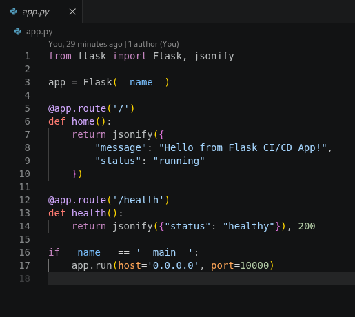
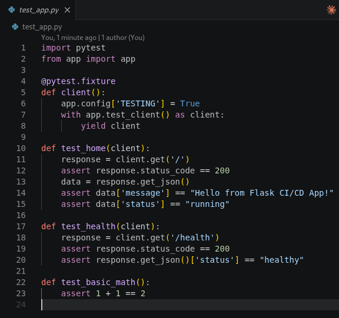
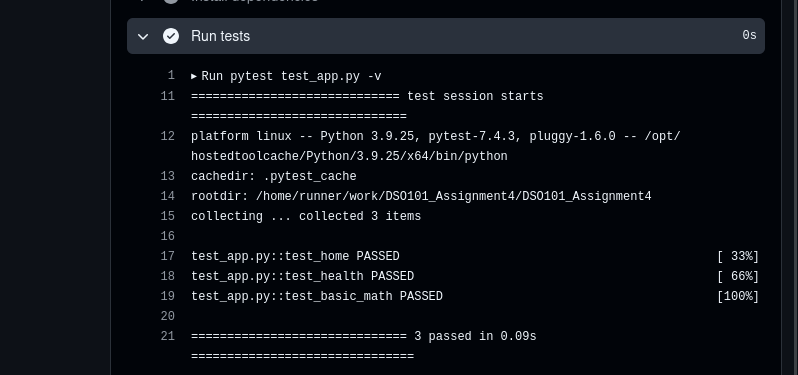
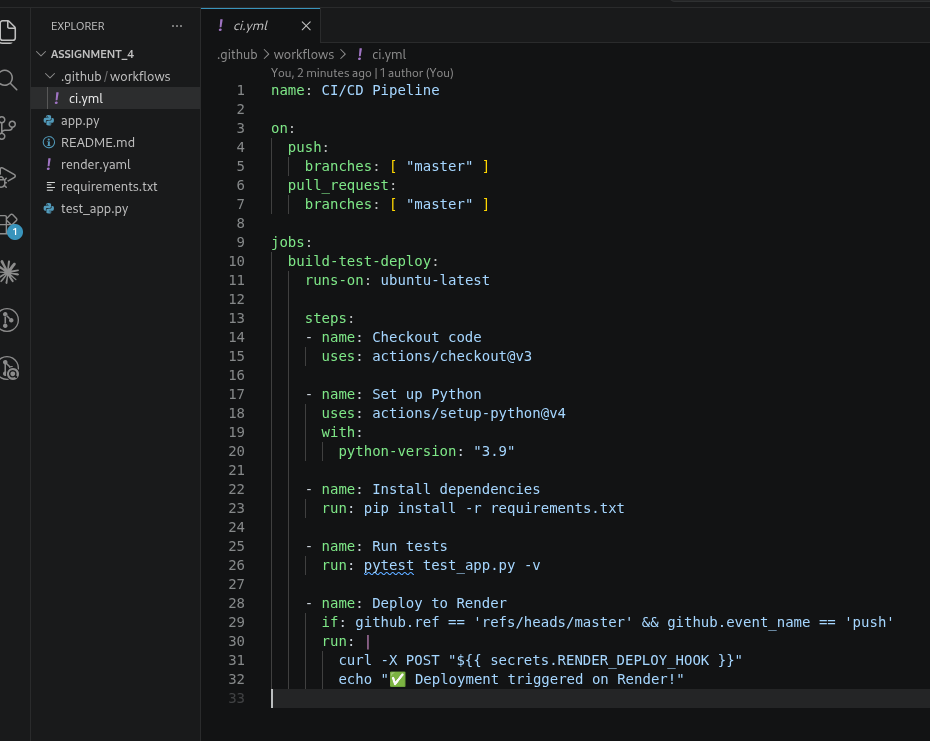
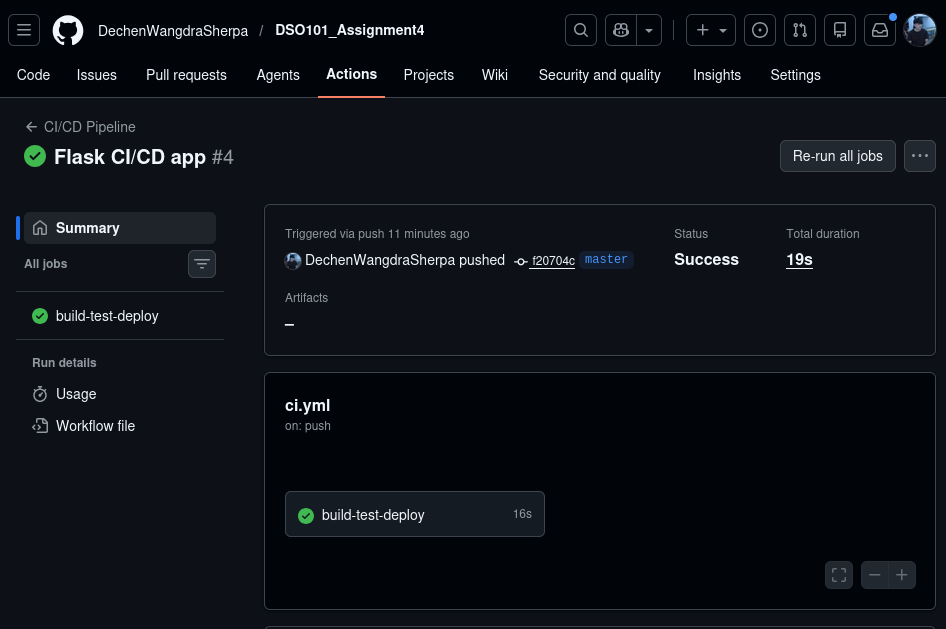
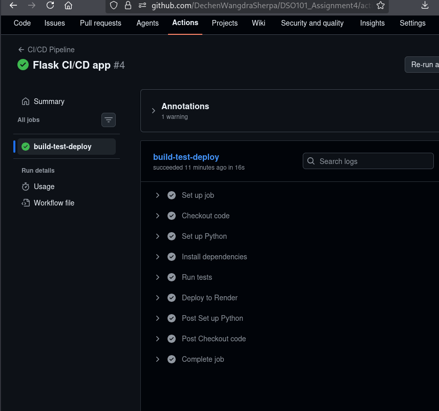
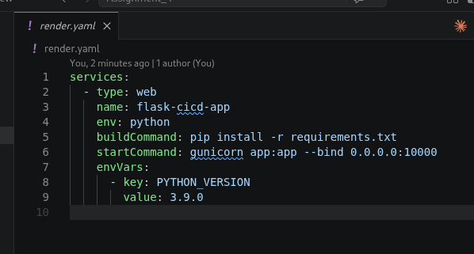
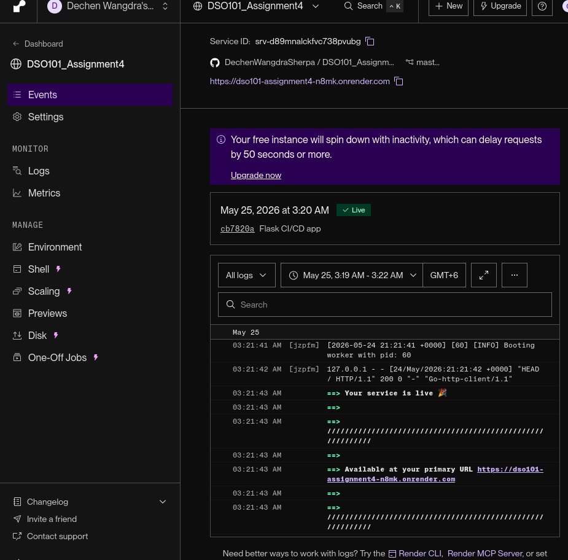
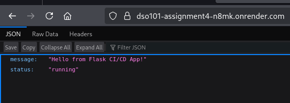
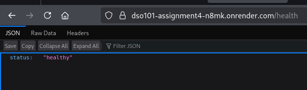

# Assignment 4: CI/CD Pipeline with Testing & Deployment

**Name:** Dechen Wangdra Sherpa  
**Student ID:** 02230281  
**Module:** DSO101  

> **Title:** Build a Complete CI/CD Pipeline with Testing & Deployment

> **Tools:** GitHub Actions · Flask · Pytest · Render

---

## Introduction

This project implements a complete **CI/CD (Continuous Integration and Continuous Deployment)** pipeline for a Flask web application. Every code push automatically triggers a build, runs all unit tests, and deploys the application to Render.

The goal is to eliminate manual deployment steps and enforce quality gates, ensuring only tested code reaches production.

---

## Project Structure

```
project/
│── app.py                        # Flask backend application
│── test_app.py                   # Unit tests (pytest)
│── requirements.txt              # Python dependencies
│── render.yaml                   # Render deployment config
└── .github/
    └── workflows/
        └── ci.yml                # GitHub Actions CI/CD pipeline
```

---

## Backend Application

The backend is built with **Flask** and exposes two endpoints:

| Endpoint | Method | Description | Response |
|----------|--------|-------------|----------|
| `/` | GET | Welcome message | `{"message": "Hello from Flask CI/CD App!", "status": "running"}` |
| `/health` | GET | Health check | `{"status": "healthy"}` |


**`app.py`**
```python
from flask import Flask, jsonify

app = Flask(__name__)

@app.route('/')
def home():
    return jsonify({
        "message": "Hello from Flask CI/CD App!",
        "status": "running"
    })

@app.route('/health')
def health():
    return jsonify({"status": "healthy"}), 200

if __name__ == '__main__':
    app.run(host='0.0.0.0', port=10000)
```



---

## Unit Testing

Tests are written using **pytest** and cover both API behavior and basic logic.

**`test_app.py`**
```python
import pytest
from app import app

@pytest.fixture
def client():
    app.config['TESTING'] = True
    with app.test_client() as client:
        yield client

def test_home(client):
    response = client.get('/')
    assert response.status_code == 200
    data = response.get_json()
    assert data['message'] == "Hello from Flask CI/CD App!"
    assert data['status'] == "running"

def test_health(client):
    response = client.get('/health')
    assert response.status_code == 200
    assert response.get_json()['status'] == "healthy"

def test_basic_math():
    assert 1 + 1 == 2
```



### Test Results

| Test | Description | Result |
|------|-------------|--------|
| `test_home` | Validates `/` returns correct JSON message and status | ✅ PASSED |
| `test_health` | Validates `/health` returns HTTP 200 and healthy status | ✅ PASSED |
| `test_basic_math` | Basic arithmetic assertion | ✅ PASSED |

### Test Output Screenshot



---

## CI/CD Pipeline

The pipeline is defined in `.github/workflows/ci.yml` and is triggered on every push or pull request to `master`.

**`.github/workflows/ci.yml`**
```yaml
name: CI/CD Pipeline

on:
  push:
    branches: [ "master" ]
  pull_request:
    branches: [ "master" ]

jobs:
  build-test-deploy:
    runs-on: ubuntu-latest

    steps:
    - name: Checkout code
      uses: actions/checkout@v3

    - name: Set up Python
      uses: actions/setup-python@v4
      with:
        python-version: "3.9"

    - name: Install dependencies
      run: pip install -r requirements.txt

    - name: Run tests
      run: pytest test_app.py -v

    - name: Deploy to Render
      if: github.ref == 'refs/heads/master' && github.event_name == 'push'
      run: |
        curl -X POST "${{ secrets.RENDER_DEPLOY_HOOK }}"
        echo "✅ Deployment triggered on Render!"
```



### Pipeline Stages

```
Push to main
     │
     ▼
┌─────────────────┐
│  1. Checkout    │  Clone the repository
└────────┬────────┘
         │
         ▼
┌─────────────────┐
│  2. Setup Python│  Configure Python 3.9
└────────┬────────┘
         │
         ▼
┌─────────────────┐
│  3. Install Deps│  pip install -r requirements.txt
└────────┬────────┘
         │
         ▼
┌─────────────────┐
│  4. Run Tests   │  pytest test_app.py -v
└────────┬────────┘
         │  (fails here if tests fail — deploy is skipped)
         ▼
┌─────────────────┐
│  5. Deploy      │  POST to Render Deploy Hook
└─────────────────┘
```

### GitHub Actions Screenshots





---

## Deployment

The app is deployed on **[Render](https://render.com)** using the configuration in `render.yaml`.

**`render.yaml`**
```yaml
services:
  - type: web
    name: flask-cicd-app
    env: python
    buildCommand: pip install -r requirements.txt
    startCommand: gunicorn app:app --bind 0.0.0.0:10000
    envVars:
      - key: PYTHON_VERSION
        value: 3.9.0
```



### How Auto-Deploy Works

1. Code is pushed to `master` on GitHub
2. GitHub Actions runs the CI pipeline
3. All tests pass
4. GitHub Actions sends a `POST` request to the Render Deploy Hook
5. Render pulls the latest code and rebuilds the app
6. New version goes live automatically

### Render Deployment Screenshot



 



---

## Live App

> **Live URL:** `https://dso101-assignment4-n8mk.onrender.com`

---

## Conclusion

This project demonstrates a fully automated CI/CD pipeline that integrates code, testing, and deployment into a single workflow. By combining GitHub Actions, Pytest, and Render, every push automatically built, tested, and deployed — with no manual steps required.